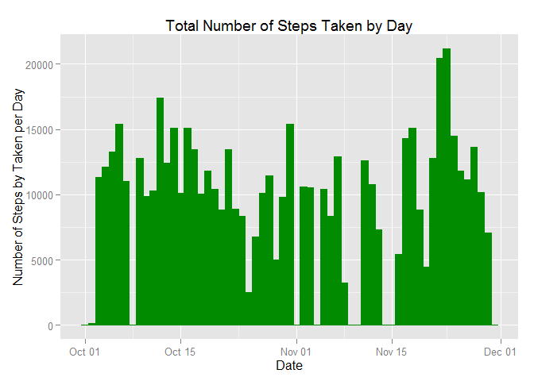
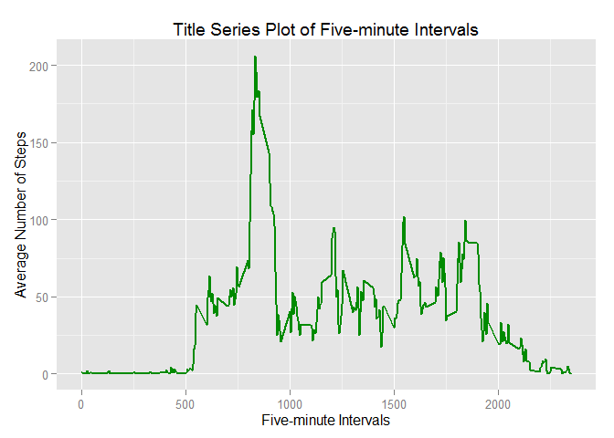
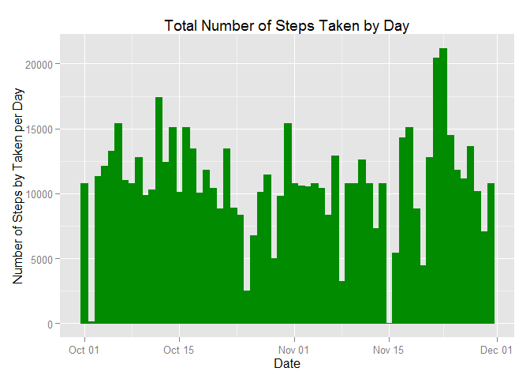

# Reproducible Research: Peer Assessment 1


## Loading and preprocessing the data  

Show any code that is needed to

1. Load the data (i.e. read.csv())  


```r
setwd("C:/Users/bdfitzgerald/Desktop/Data Science Specialist/RepData_PeerAssessment1")
unzip("activity.zip")
data <- read.csv("activity.csv")
options(scipen = 1)  # Turn off scientific notations for numbers
```

2. Process/transform the data (if necessary) into a format suitable for your analysis  


```r
data$date <- as.Date(data$date) ## reclass date as a Date
sapply(data, class) ## see the class of the data
```

```
##     steps      date  interval 
## "integer"    "Date" "integer"
```

```r
head(data, 3) ## Views the first three rows
```

```
##   steps       date interval
## 1    NA 2012-10-01        0
## 2    NA 2012-10-01        5
## 3    NA 2012-10-01       10
```

```r
summary(data)
```

```
##      steps             date               interval     
##  Min.   :  0.00   Min.   :2012-10-01   Min.   :   0.0  
##  1st Qu.:  0.00   1st Qu.:2012-10-16   1st Qu.: 588.8  
##  Median :  0.00   Median :2012-10-31   Median :1177.5  
##  Mean   : 37.38   Mean   :2012-10-31   Mean   :1177.5  
##  3rd Qu.: 12.00   3rd Qu.:2012-11-15   3rd Qu.:1766.2  
##  Max.   :806.00   Max.   :2012-11-30   Max.   :2355.0  
##  NA's   :2304
```

```r
dim(data)
```

```
## [1] 17568     3
```
  
  
## What is mean total number of steps taken per day?

For this part of the assignment, you can ignore the missing values in the dataset


```r
num_nas <- sum(is.na(data)) ## number of NAs in the data
```

A total of 2304 will be omitted.  
  
1. Make a histogram of the total number of steps taken each day.  


```r
steps.taken <- aggregate(data$steps, by = list(Date = data$date), sum, na.rm = TRUE)
colnames(steps.taken)[2] <- "num_steps"
library("ggplot2")
steps <- ggplot(steps.taken, aes(Date, num_steps)) + 
        geom_bar(stat = "identity", colour = "green4", fill = "green4", width = 1) + 
        labs(title = "Total Number of Steps Taken by Day", 
             x = "Date", y = "Number of Steps by Taken per Day") 
steps
```

 
  
2.Calculate and report the mean and median total number of steps per day.   


```r
steps.mean <- round(mean(steps.taken$num_steps, na.rm = TRUE), 2) ## Round to two decimals 
steps.median <- round(median(steps.taken$num_steps, na.rm = TRUE), 2) ## Round to two decimals
```

The mean number of steps per day is 9354.23, while the median is 10395.

## What is the average daily activity pattern?

1. Make a time series plot (i.e. type = "l") of the 5-minute interval (x-axis) and the average number of steps taken, averaged across all days (y-axis).


```r
avg.steps.taken <- aggregate(data$steps, by = list(intervals = data$interval), mean, na.rm = TRUE) 
colnames(avg.steps.taken)[2] <- "avg_steps"
avg.steps <- ggplot(avg.steps.taken, aes(x = intervals, y = avg_steps)) +
        geom_line(color = "green4", size = 0.75) +
        ylim(0, max(avg.steps.taken$avg_steps)) +
        xlab("Five-minute Intervals") +
        ylab("Average Number of Steps") +
        ggtitle("Title Series Plot of Five-minute Intervals") 
avg.steps
```

 

2. Which 5-minute interval, on average across all the days in the dataset, contains the maximum number of steps?


```r
ast.interval <- avg.steps.taken[avg.steps.taken$avg_steps == max(avg.steps.taken$avg_steps), ]
ast.interval
```

```
##     intervals avg_steps
## 104       835  206.1698
```

The interval containing the maximum number of steps is 835.

## Imputing missing values

Note that there are a number of days/intervals where there are missing values (coded as NA). The presence of missing days may introduce bias into some calculations or summaries of the data.

1. Calculate and report the total number of missing values in the dataset (i.e. the total number of rows with NAs)


```r
num_nas <- sum(is.na(data)) ## number of NAs in the data
```

There are a total of 2304 NAs in the data.

2. Devise a strategy for filling in all of the missing values in the dataset. The strategy does not need to be sophisticated. For example, you could use the mean/median for that day, or the mean for that 5-minute interval, etc.

In order to replace the NAs in the data, the method that was used was using the mean for the five-minute interval.

3. Create a new dataset that is equal to the original dataset but with the missing data filled in.


```r
data2 <- data
for (i in 1:nrow(data2)) {
                ## if the data is shown to be an NA, it is replaced with the avg
        if(is.na(data2[i, 1])) {
                data2[i, 4] <- avg.steps.taken[which(data2$interval[i] == avg.steps.taken$interval),]$avg_steps} 
                ## if the data is not shown to be an NA, the original data was placed in
        else {data2[i, 4] <- data[i, 1]}
        colnames(data2)[4] <- "steps_rv"
}
                ## Rounding the data for the average to one decimal
data2$steps_rv <- round(data2$steps_rv,2)
                ## removing the old steps with the NAs
data2 <- data2[,c(4,2:3)]
                ## check to see how many NAs
sum(is.na(data2$steps_rv))
```

4. Make a histogram of the total number of steps taken each day and Calculate and report the mean and median total number of steps taken per day. Do these values differ from the estimates from the first part of the assignment? What is the impact of imputing missing data on the estimates of the total daily number of steps?


```r
steps.taken.rv <- aggregate(data2$steps_rv, by = list(Date = data2$date), sum, na.rm = TRUE)
colnames(steps.taken.rv)[2] <- "num_steps"
steps_rv <- ggplot(steps.taken.rv, aes(Date, num_steps)) + 
        geom_bar(stat = "identity", colour = "green4", fill = "green4", width = 1) + 
        labs(title = "Total Number of Steps Taken by Day", 
             x = "Date", y = "Number of Steps by Taken per Day")
steps_rv
```

 

```r
steps_rv.mean <- mean(steps.taken.rv$num_steps, na.rm = TRUE)
steps_rv.median <- median(steps.taken.rv$num_steps, na.rm = TRUE)
```

The new data's mean of the number of steps is 10766.1809836, while the new median is 10766.13.    
As a reminder, the original data's mean is 9354.23, while the median is 10395.  
In comparison, the replacing the NAs moved the mean and median closer together.   

## Are there differences in activity patterns between weekdays and weekends?

For this part the weekdays() function may be of some help here. Use the dataset with the filled-in missing values for this part.

1. Create a new factor variable in the dataset with two levels - "weekday" and "weekend" indicating whether a given date is a weekday or weekend day.


```r
data2$dayofweek <- factor(format(data2$date, "%A"))
for (i in 1:nrow(data2)) {
        if (data2[i, 4] == "Saturday" | data2[i, 4] == "Sunday") {data2[i, 5] <- "Weekend"}
        else {data2[i, 5] <- "Weekday"}
        colnames(data2)[5] <- "Weekday_Weekend"
}
```


2. Make a panel plot containing a time series plot (i.e. type = "l") of the 5-minute interval (x-axis) and the average number of steps taken, averaged across all weekday days or weekend days (y-axis). See the README file in the GitHub repository to see an example of what this plot should look like using simulated data.


```r
avg.steps.taken_rv <- aggregate(data2$steps_rv, by = list(Interval = as.numeric(data2$interval), 
                                                          Weekday_end = data2$Weekday_Weekend), 
                                mean, na.rm =TRUE)
colnames(avg.steps.taken_rv)[3] <- "avg_steps"
avg.steps.taken_rv$avg_steps <- round(avg.steps.taken_rv$avg_steps, 2)
library(lattice)
weekday_end <- xyplot(avg.steps.taken_rv$avg_steps ~ avg.steps.taken_rv$Interval | avg.steps.taken_rv$Weekday_end,
                      layout = c(1,2), type = "l", 
                      xlab = "Interval", ylab = "Average Number of Steps")
weekday_end
```

 

